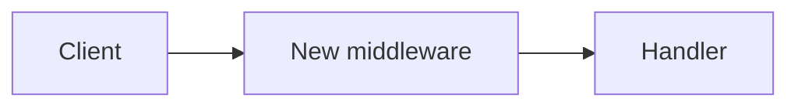

# Create Pull Request

Open a well-formed GitHub PR that matches the repository's conventions and links its issues correctly.

## When to use

The user has committed work on a branch and wants to open it for review, or asks anything like "create a PR", "open a pull request", "raise a PR for this". If work isn't committed yet, commit it first (only when the user wants that) before continuing.

## Workflow

### 1. Gather context

Run these to understand the state of the branch:

```bash
git branch --show-current
git log --oneline origin/HEAD..HEAD 2>/dev/null || git log --oneline -10
git diff --stat origin/HEAD...HEAD 2>/dev/null || git diff --stat
```

Read the actual diff (`git diff origin/HEAD...HEAD`) so the PR description reflects what truly changed — not a guess. The description should explain *what* changed and *why*, grounded in the commits and diff.

### 2. Find the PR template

Look for the repository's template, checking these paths in order (GitHub recognizes all of them, case-insensitively):

- `.github/PULL_REQUEST_TEMPLATE.md`
- `.github/pull_request_template.md`
- `PULL_REQUEST_TEMPLATE.md`
- `docs/PULL_REQUEST_TEMPLATE.md`
- `.github/PULL_REQUEST_TEMPLATE/` (a directory of multiple templates — if present, pick the most relevant or ask the user)

```bash
ls .github/PULL_REQUEST_TEMPLATE.md .github/pull_request_template.md PULL_REQUEST_TEMPLATE.md docs/PULL_REQUEST_TEMPLATE.md 2>/dev/null
```

If a template exists, use it verbatim as the structure and fill in its sections from the diff. The repo's own template always wins over the default — it encodes that team's conventions.

If none exists, use the default template in `assets/default_template.md`.

### 3. Fill out the template

Populate the template honestly from the diff and commits:

- Check the boxes that apply (PR type, testing done). Don't check testing boxes for tests you can't confirm ran — leave them unchecked or note what's still needed.
- Write the description so a reviewer understands the change without reading every line. Lead with intent.
- Only claim things the diff supports. An empty section is better than an invented one.

### 4. Link issues so merging closes them

If the branch came from a GitHub issue, or the user mentions an issue number, wire up closing keywords so the issue auto-closes when the PR merges. Use GitHub's closing keywords, one issue per keyword:

```
Closes #123
Closes #456
```

To detect the issue, check the branch name (e.g. `feature/123-add-auth`, `fix/issue-456`) and ask the user if ambiguous. Put the `Closes #N` lines in the PR body (the default template has a `Closes #` line under Description for this). For multiple issues, use a separate `Closes #N` for each — `Closes #1, #2` does **not** close both.

### 5. Add a mermaid diagram when it clarifies

If the change has structure worth showing — a new flow, a sequence of calls, a state machine, a non-trivial architecture change — include a mermaid diagram in the description. It often explains a PR faster than prose. Skip it for small or purely textual changes; a diagram for a one-line fix is noise.

````

````

### 6. Create the PR

Push the branch and create the PR with `gh`. Write the body to a temp file to preserve formatting:

```bash
git push -u origin HEAD
gh pr create --title "<title>" --body-file /tmp/pr_body.md
```

Choose a title that matches the repo's convention (check recent PRs with `gh pr list --state all --limit 10` if unsure — e.g. Conventional Commits like `feat(auth): ...`). After creation, show the user the PR URL.

## Notes

- If `gh` isn't authenticated (`gh auth status` fails), tell the user to run `gh auth login` rather than failing silently.
- Never invent test results or check boxes for work not done — a reviewer trusts the checklist.
- Match the existing repo conventions over personal preference: title style, label usage, base branch.
